# Computer Vision

## Description
Welcome to my __Computer Vision__ reposetory! Here you will find various Computer Vision related projects on topics as Photmetric Stereoand Color, Neighborhood Processingand Filters, Harris Corner Detector and Optical Flow, Image Alignment and Stitching, Bag-of-Words and CNNs for Image Classification.

### [__Lab 1__: Photometric Stereo & Color](lab_assignments/1)

- [Assignment](lab_assignments/1/cv1_labs_A1), [report](lab_assignments/1/Report) and [code](lab_assignments/1/)

  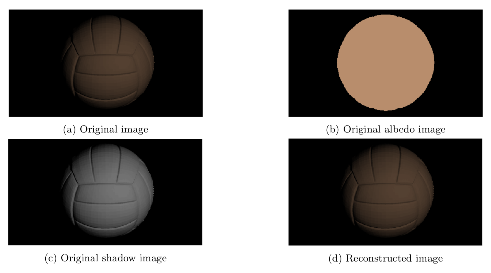
  Image decomposition and reconstruction.

  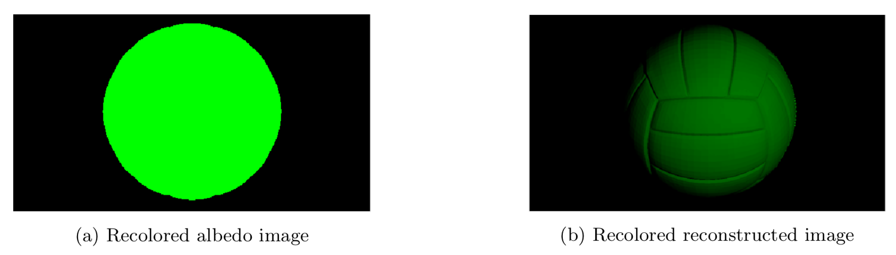
  Image recoloring.

  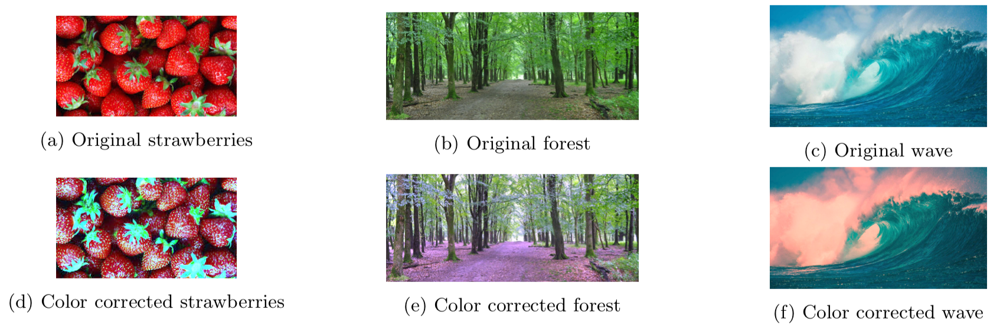
  Three examples highlighting color correction failures in images with high focus on single colors.

### [__Lab 2__: Neighborhood Processing & Filters](lab_assignments/2)
- [Assignment](lab_assignments/1/cv1_labs_A2), [report](lab_assignments/1/Report) and [code](lab_assignments/2/)

  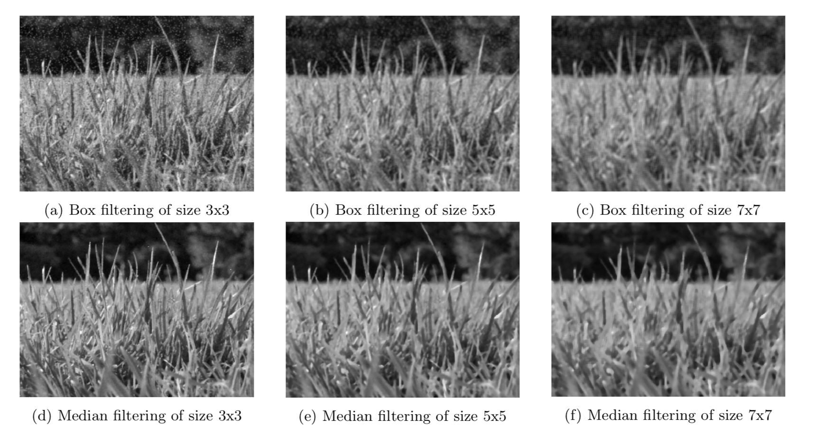
  Denoised Salt & Pepper image.

  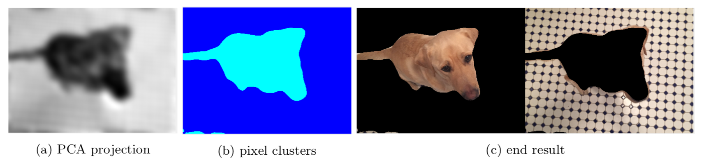
  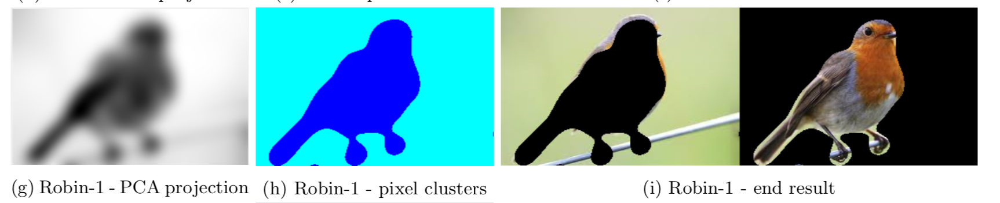
  Kobi Gabor segmentation.

### [__Lab 3__: Harris Corner Detector & Optical Flow](lab_assignments/3)
- [Assignment](lab_assignments/1/cv1_labs_A3), [report](lab_assignments/1/Report) and [code](lab_assignments/3/)

  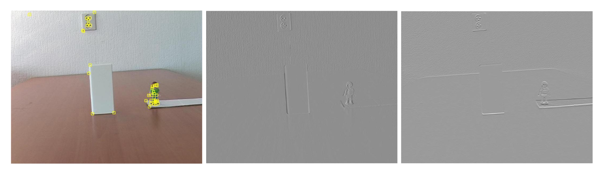
  Original image with the corner points plotted on it (left), followed by the image derivatives Ix (center) and Iy (right).

  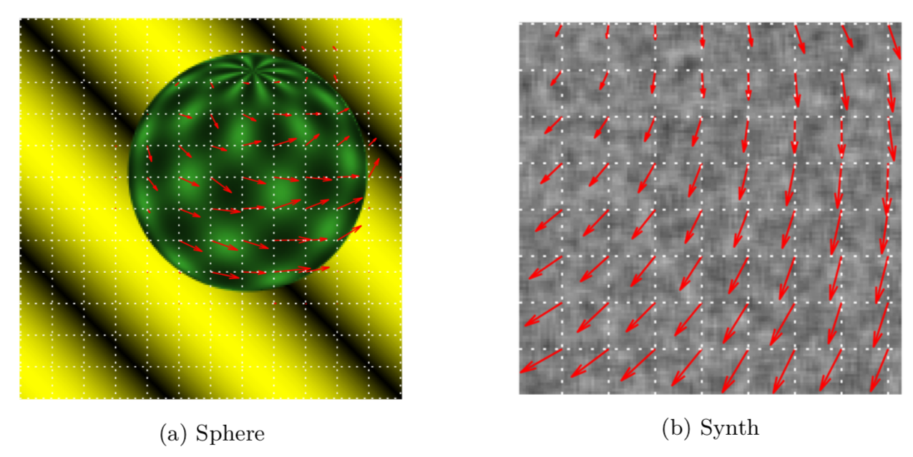
  Optical flow vectors for pairs of images.

### [__Lab 4__: Image Alignment and Stitching](lab_assignments/4)
- [Assignment](lab_assignments/1/cv1_labs_A4), [report](lab_assignments/1/Report) and [code](lab_assignments/4/)

  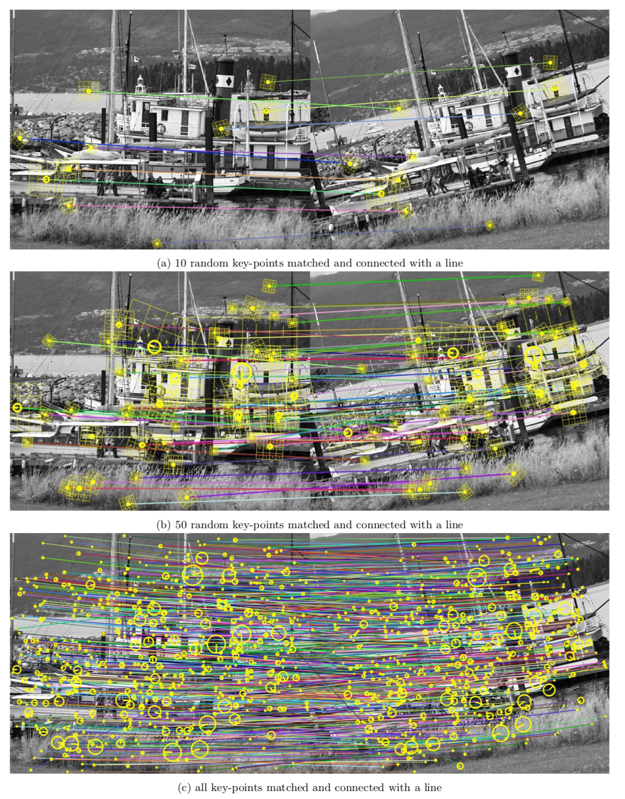
  Matching points between the two images.

  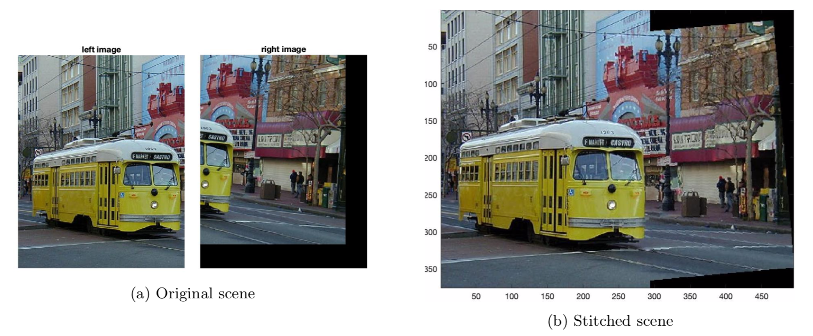
  A peaceful tram scene magically appeared from two separate pictures.

### [__Lab 5__: Bag-of-Words based Image Classification](lab_assignments/Final)
- [Assignment](lab_assignments/1/cv1_labs_A1), [report](lab_assignments/1/Report) and [code](lab_assignments/Final/)

  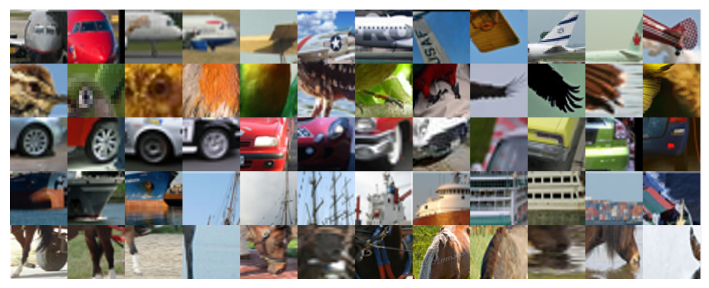
  Examples of visual words per class which have meaningful interpretation for humans. Every row represents a different class. From the top to the bottom we illustrate airplane, bird, car, ship and horse classes.

  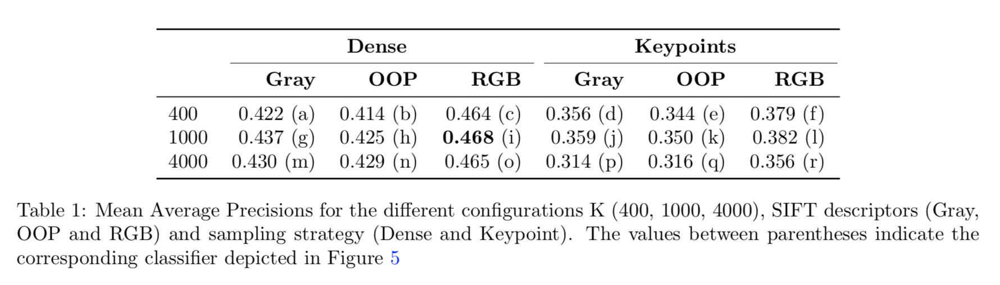

### [__Lab 6__: CNNs for Image Classification](lab_assignments/Final-2)
- [Assignment](lab_assignments/1/cv1_labs_A1), [report](lab_assignments/1/Report) and [code](lab_assignments/Final-2/)

  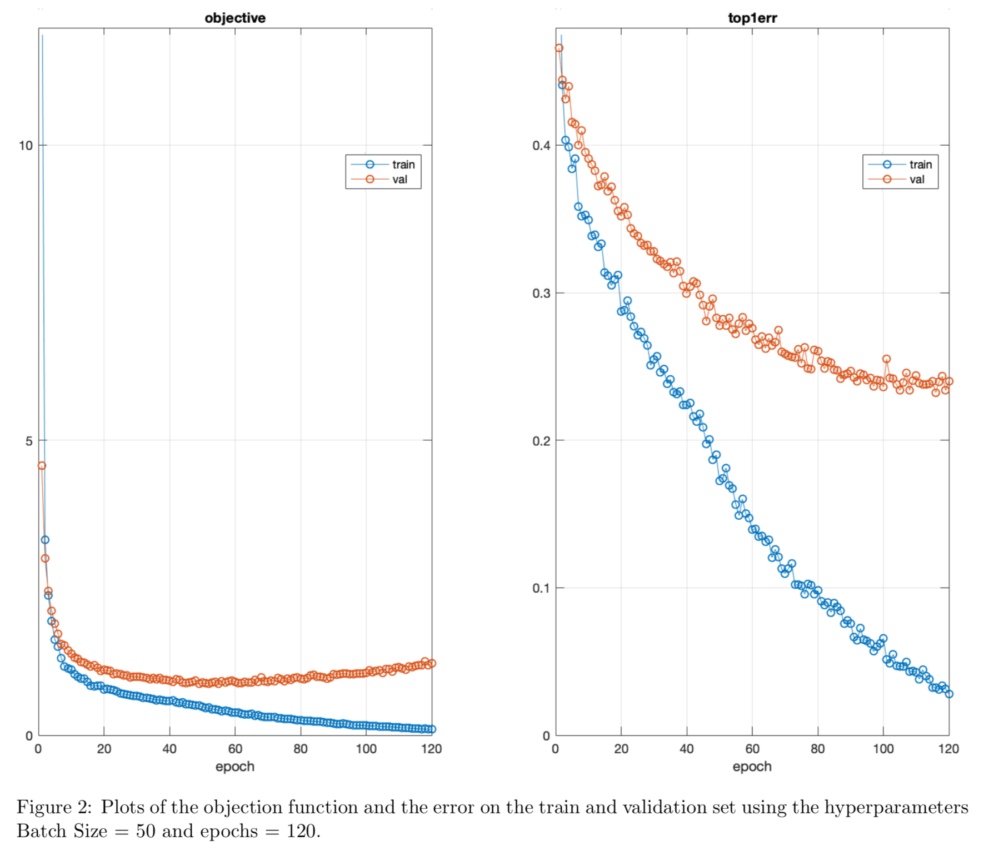

  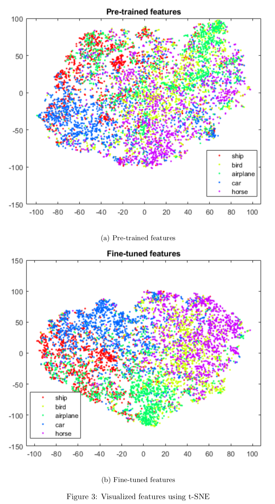

